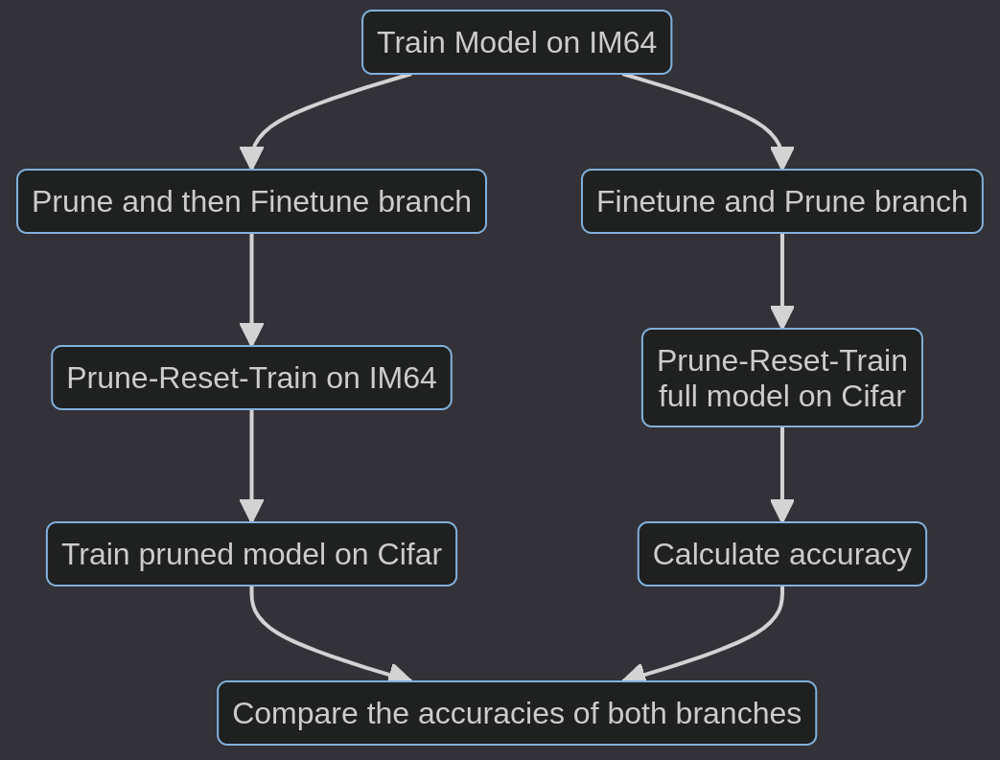

# Neural Networks at a Fraction

Presentation By: <a href="https://peithonking.github.io/portfolio-page/">Aritra Mukhopadhyay</a>

---

## P1: Attention Is All You Need

&emsp; Here we learn about the transformer architecture, the self-attention mechanism and the multi-head attention mechanism. We also learn about the positional encoding and the residual connections.

---

## P2: End-to-End Object Detection with Transformers

&emsp; DETR introduces a novel object detection approach using a transformer encoder-decoder architecture, achieving competitive accuracy and efficiency. Although it is slow, it beats Faster RCNN in terms of accuracy.

---

## P3: GriTS

&emsp; This paper introduces "GriTS," a novel metric for table structure recognition (TSR) evaluation. It evaluates predicted tables directly as matrices, generalizing the NP-hard 2D-LCS problem to 2D-MSS for efficient similarity assessment, outperforming other metrics and unifying TSR subtasks.

---

## Experiments we have done

- Converting the models to ONNX
- Quantization of the models
- *Implement of real and quaternion transformer
- **Prune-Finetune** vs **Finetune-Prune**

 

*We would discuss this the other day!

---

### Converting the models to ONNX

- ONNX is a open format to represent deep learning models.
- ONNX is supported by a number of frameworks and tools including Microsoft, Facebook, and Amazon.
- To deploy the TSR model in a mobile device, we need to convert the model to ONNX format.

---

<!-- it doesn't just rounds off the numbers, it can sometimes make 3.25 to 4, sometimes, 3.68 to 3 -->

### Quantization of the models

- Quantization is a technique to reduce the size of the model.
- Quantization is done by reducing the precision of the weights and activations.
- It is not just just changing the data type to int, it also takes care the accuracy of the model is affected the least.

---

### Prune-Finetune vs Finetune-Prune

This was the toughest part of the project. We took pretrained real and quaternion, pruned and unpruned models from imagenet training. We replaced their last layers from similarly pruned and trained cifar100 last layers. We then trained (finetuned) the pruned model on cifar100 and we performed prune-reset-train loop on the unpruned model. We have the results to compare.

---

<!-- here is the plan -->

---

## Results

| Model Type     | Initial Accuracy | Retrained Accuracy | Branch                 |
| -------------- | ---------------- | ------------------ | ---------------------- |
| Unpruned Model | 65%              | 77%                | right (finetune-prune) |
| Pruned Model   | 64%              | 75%                | left (prune-finetune)  |

<!-- 
- Initialy the unpruned model had ~65% and the pruned model had ~64% accuracy on cifar100.
- The accuracy increased to ~77% for the unpruned model on retraining on cifar 100.
- The accuracy increased to 75.23% for the pruned model on retraining on cifar 100.
-->
